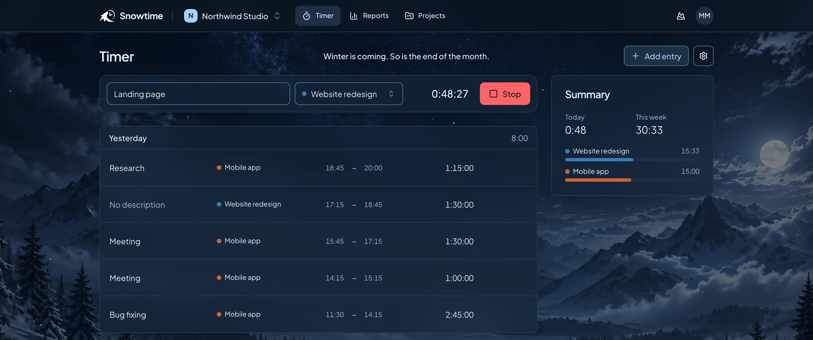

<h1 align="center">
  <picture>
    <source media="(prefers-color-scheme: dark)" srcset="design/brand-assets/lockups/02-hound-hour-dark.svg" />
    
  </picture>
</h1>

<p align="center">
  A minimal, multi-tenant time tracker in the spirit of Toggl.<br />
  <a href="https://snowtime.snowhound.eu"><strong>snowtime.snowhound.eu</strong></a>
</p>

<p align="center">
  
</p>

Snowhound built Snowtime for its own teams, and it can host other organizations from the
same deployment.

## Features

- One-click timer with a description and project
- Organizations, teams, members, and invitations, with owner, admin, member, and team
  lead roles
- Projects per organization, optionally assigned to teams
- Reports per day, week, project, team, and member in the user's time zone, with CSV and
  XLSX export
- Sign-in with Google, GitHub, Microsoft, or a passkey
- English and Estonian

The scope and what is left out on purpose are in [docs/product.md](docs/product.md).

## Stack

[TanStack Start](https://tanstack.com/start) with [Solid](https://www.solidjs.com),
[Turso](https://turso.tech) (libSQL) through [Drizzle](https://orm.drizzle.team),
[Better Auth](https://www.better-auth.com), [Solid-UI](https://www.solid-ui.com) with
Tailwind CSS, and [Paraglide JS](https://inlang.com/m/gerre34r/library-inlang-paraglideJs).
It is deployed to [Vercel](https://vercel.com). Each choice and its reason is recorded in
[docs/architecture.md](docs/architecture.md).

## Getting started

Requires [Bun](https://bun.sh) 1.3 or later.

```bash
bun install
bun run env:init
bun run db:migrate
bun run db:seed
bun --bun run dev
```

The app runs on http://localhost:3000 against a local SQLite file, `local.db`.
`.env.development` sets the database and app URL, and `bun run env:init` adds the one
variable left, a generated `BETTER_AUTH_SECRET`, to the gitignored `.env.local`. Put other
local overrides, such as OAuth credentials, there too; `.env.example` lists every variable.

### Seeded users

`bun run db:seed` fills the local database with demo data (`src/db/seed.ts`). It refuses
any database that is not a local file. Every seeded user signs in with the password
`snowtime-local`; password sign-in is enabled only in local development.

| Email                | Name         | Role                                                                     |
| -------------------- | ------------ | ------------------------------------------------------------------------ |
| `owner@example.com`  | Olivia Owner | Owner of Northwind Studio                                                |
| `admin@example.com`  | Adam Admin   | Admin of Northwind Studio, owner of Harbor Consulting                    |
| `lead@example.com`   | Lena Lead    | Member of Northwind Studio, lead of Design                               |
| `member@example.com` | Max Member   | Member in Design, Engineering and Harbor's Delivery; has a running timer |
| `theo@example.com`   | Theo Lead    | Member of Northwind Studio, lead of Engineering                          |
| `mia@example.com`    | Mia Engineer | Member in Engineering, lead of Delivery in Harbor Consulting             |
| `noah@example.com`   | Noah Solo    | Member of Northwind Studio, in no team                                   |

To start over: `rm local.db && bun run db:migrate && bun run db:seed`.

### A mid-sized company

`bun run db:seed --company` also adds Lumen Works (`src/db/seed-company.ts`), for checking
queries and pages at a realistic size: 18 members in four teams, one former member, and
about 20,000 entries over the year before the seed ran. The year has weekends, holidays,
vacations, part-time and late-joining members, projects archived partway through, evening
and overnight work, descriptions with ticket keys such as `NBW-412`, and three running
timers. Run it on a database seeded without it to
add the company. It takes under a second.

The sign-in page also lists five of its users, with the same password:

| Email                         | Name           | Role                                                                    |
| ----------------------------- | -------------- | ----------------------------------------------------------------------- |
| `kristiina@lumen.example.com` | Kristiina Kask | Owner, in no team                                                       |
| `jonas@lumen.example.com`     | Jonas Berg     | Admin, in Web                                                           |
| `sofia@lumen.example.com`     | Sofia Rossi    | Lead of Web                                                             |
| `daniel@lumen.example.com`    | Daniel Park    | Lead of Mobile, in New York, weeks start on Sunday; has a running timer |
| `marta@lumen.example.com`     | Marta Nowak    | Member in Design and Web, works three days a week                       |

## Scripts

| Command                       | What it does                                       |
| ----------------------------- | -------------------------------------------------- |
| `bun --bun run dev`           | Starts the dev server on port 3000                 |
| `bun run build`               | Builds for production                              |
| `bun run test`                | Runs server tests (`bun test`) and component tests |
| `bun run lint`                | Runs oxlint                                        |
| `bun run format`              | Formats with oxfmt                                 |
| `bun run env:init`            | Adds a `BETTER_AUTH_SECRET` to `.env.local`        |
| `bun run db:generate <name>`  | Creates an empty SQL migration                     |
| `bun run db:migrate`          | Verifies and applies migrations                    |
| `bun run db:drift`            | Compares the Drizzle schema with the migrations    |
| `bun run db:seed [--company]` | Seeds the local database with demo data            |
| `bun run datamodel`           | Opens the data model in ChartDB (needs Docker)     |

## Database

The SQL migrations in `drizzle/` define the schema; they are written by hand, and
`src/db/schema.ts` follows them. Read [docs/migrations.md](docs/migrations.md) before
changing the schema. The data model, its diagram, and how to view it are in
[datamodel/README.md](datamodel/README.md).

## Deployment

Snowtime runs on Vercel with a Turso database per environment: `prod` for `main`, and a
planned `staging` for `develop`. After the checks pass on a push to `main`, CI migrates
`prod` with `TURSO_DATABASE_URL` and `TURSO_AUTH_TOKEN` from the GitHub environment
`production`, and skips with a notice while they are unset. The Vercel build and app start
never apply migrations.

It can also run self-hosted on one Linux server, with SQLite in the app's process, Caddy
in front, and Litestream backups. [docs/deployment/](docs/deployment/README.md) compares
the two and has a step-by-step runbook for each.

The same codebase can also run as a dedicated stack per client, configured only through
environment variables. Platform limits are in [docs/hosting.md](docs/hosting.md).

## Documentation

- [Product](docs/product.md): purpose, MVP scope, and tenancy
- [Architecture](docs/architecture.md): recorded decisions and their reasons
- [Hosting](docs/hosting.md): Vercel, Turso, and self-hosted constraints
- [Deployment](docs/deployment/README.md): runbooks for Vercel and for self-hosting
- [Migrations](docs/migrations.md): how to change the schema
- [Data model](datamodel/README.md): the DBML diagram and its conventions
- [Prototypes](prototypes/README.md): HTML prototypes of each view and the brand
- [Design process](docs/design-process.md): how the design took shape
- [Tasks](tasks/README.md): open work; finished tasks are in `tasks/000-archive/`

## Contributing

Code is grouped by feature in `src/features/` and by domain in `src/server/`. The
conventions are in [AGENTS.md](AGENTS.md). A pre-commit hook runs oxlint and oxfmt on
staged files, and CI checks formatting, lint, types, tests, and schema drift on every
pull request.

## License

[MIT](LICENSE). Third-party assets keep their own licenses; see
[prototypes/THIRD_PARTY_NOTICES.md](prototypes/THIRD_PARTY_NOTICES.md) and the font
license in `design/brand-assets/fonts/`.
